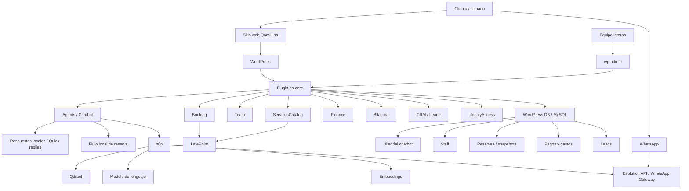

# ADR-012: Vision general y arquitectura de QS Manager

## Estado

Aceptado.

## Contexto

QS Manager es el sistema interno de gestion para Qamiluna Studio, un estudio de maquillaje y
peinado en Chile. El proyecto nace para ordenar la operacion del estudio en un unico lugar:
atencion a clientas, reservas, equipo, servicios, seguimiento comercial, bitacora operativa,
finanzas basicas y automatizaciones.

El sitio principal ya vive sobre WordPress, por lo que la decision base del proyecto es extender
esa plataforma mediante un plugin propietario llamado `qs-core`, en vez de construir una aplicacion
externa desde cero. Esto permite aprovechar la infraestructura existente, la base de datos de
WordPress, el panel administrativo y plugins ya instalados como LatePoint.

Ademas del sitio web, el proyecto incorpora canales de conversacion y automatizacion: chatbot web,
WhatsApp, n8n, Qdrant, modelos de lenguaje y servicios de mensajeria. La meta no es solo responder
preguntas, sino convertir esas conversaciones en acciones utiles para el negocio.

## Decision

Se implementa QS Manager como un plugin WordPress propietario, modular y desplegable, llamado
`qs-core`.

La arquitectura adoptada es un monolito modular con separacion clara por dominios funcionales:

- `Agents`: chatbot, RAG, WhatsApp, feedback y trazabilidad conversacional.
- `Booking`: lectura y adaptacion de reservas desde LatePoint.
- `Team`: staff, disponibilidad, roles operativos y especialidades.
- `ServicesCatalog`: catalogo de servicios enriquecido sobre LatePoint.
- `Bitacora`: registro de actividades, seguimientos y operacion diaria.
- `Finance`: pagos, gastos, margenes y exportaciones.
- `CRM`: leads, timeline comercial y conversion.
- `IdentityAccess`: roles y permisos propios del estudio.
- `Setup`: instalacion inicial, comandos, provisionamiento y chequeos.
- `ContentWeb`, `CommunityOps`, `Meetings` y `Strategy`: areas preparadas para crecimiento futuro.

El plugin expone funcionalidades mediante WordPress REST API bajo el namespace `qs/v1`, mantiene
persistencia en MySQL/MariaDB y usa una combinacion de Custom Post Types, tablas propias y opciones
de WordPress segun la naturaleza de cada dato.

Las automatizaciones externas se delegan a n8n. WordPress conserva el control principal del negocio
y n8n se usa como orquestador de integraciones, especialmente para flujos de IA, RAG, ingesta de
contenido y mensajeria WhatsApp.

## Explicacion funcional

Desde el punto de vista del estudio, QS Manager funciona como un centro de operaciones.

Una clienta puede interactuar con Qamiluna desde el sitio web o WhatsApp. Esa consulta llega a
WordPress y entra al plugin `qs-core`. Si el mensaje es simple, el sistema puede responder con reglas
locales o respuestas rapidas. Si requiere informacion mas contextual, el plugin consulta un workflow
de n8n que usa una base vectorial en Qdrant y un modelo de lenguaje para construir una respuesta
informada por el contenido del sitio y documentos de contexto.

Si la conversacion se transforma en una intencion de reserva, WordPress guia un flujo local con los
datos necesarios: servicio, comuna, direccion, telefono y fecha preferida. Al completarse, el sistema
puede notificar al staff por WhatsApp usando n8n como router.

En paralelo, el equipo interno puede administrar informacion desde `wp-admin`: servicios, equipo,
bitacoras, datos financieros, reservas o configuracion del chatbot. El objetivo es que la operacion
no dependa de planillas dispersas ni de conversaciones aisladas.

## Flujo general

```text
Clienta
  -> Sitio web o WhatsApp
  -> WordPress
  -> Plugin qs-core
  -> Modulos internos
      -> Agents / Chatbot
      -> Booking
      -> Team
      -> ServicesCatalog
      -> Finance
      -> Bitacora
      -> CRM
  -> Base de datos WordPress / MySQL
  -> n8n para automatizaciones
      -> Qdrant para contexto RAG
      -> LLM para respuestas
      -> Evolution API o Meta API para WhatsApp
```

## Diagrama de arquitectura



## Criterios de diseno

- Mantener WordPress como plataforma principal para reducir complejidad operativa.
- Encapsular dependencias de WordPress dentro de infraestructura, evitando contaminar el dominio.
- Separar el sistema por modulos para que cada area del negocio pueda evolucionar sin bloquear a
  las demas.
- Usar REST API nativa de WordPress para integraciones internas y externas.
- Delegar automatizaciones a n8n, pero mantener en `qs-core` las reglas centrales del negocio.
- Registrar conversaciones, feedback y eventos relevantes para mejorar la operacion con datos reales.
- Preparar el sistema para crecer desde Qamiluna hacia posibles futuros sitios o perfiles.

## Consecuencias positivas

- El estudio obtiene una base unica para su operacion diaria.
- El equipo puede administrar procesos desde una interfaz conocida: WordPress.
- Las conversaciones del chatbot pueden conectarse con acciones reales, como reservas o avisos al
  staff.
- La arquitectura modular permite agregar funcionalidades sin reescribir todo el sistema.
- n8n permite integrar IA, WhatsApp y procesos externos sin acoplar todo directamente al plugin.
- El enfoque permite empezar simple y escalar por fases.

## Consecuencias negativas y riesgos

- El sistema depende de varios servicios externos: n8n, Qdrant, proveedor LLM, Evolution API y hosting.
- WordPress sigue siendo una plataforma compartida, por lo que hay que cuidar rendimiento, seguridad y
  compatibilidad con plugins.
- WhatsApp mediante Evolution API agrega riesgo operativo por ser una via no oficial.
- La IA puede tener latencia, costos variables o respuestas imperfectas si el contexto no esta bien
  indexado.
- El monolito modular exige disciplina: si los modulos empiezan a depender entre si sin reglas claras,
  la arquitectura se puede degradar.

## Alternativas consideradas

### Aplicacion externa independiente

Crear una aplicacion separada habria dado mayor libertad tecnica, pero aumentaba costos,
infraestructura, autenticacion, despliegue y mantenimiento. No era la opcion mas pragmatica para el
estado actual del negocio.

### Todo en plugins existentes

Depender solo de plugins comerciales o configuraciones manuales habria reducido desarrollo inicial,
pero dejaba la operacion fragmentada y con poca capacidad de automatizacion propia.

### Chatbot completamente externo

Enviar todo el flujo conversacional directamente a n8n o a una plataforma de IA simplificaba el
plugin, pero hacia mas dificil controlar reservas, permisos, historial, feedback y fallbacks desde
WordPress.

## Estado esperado del proyecto

QS Manager debe operar como una plataforma interna gradual:

1. Primero consolida la base tecnica, roles, reservas, staff y chatbot.
2. Luego incorpora bitacora, finanzas y seguimiento comercial.
3. Finalmente habilita capacidades mas avanzadas: reuniones, estrategia, operaciones comunitarias y
   perfiles reutilizables para otros sitios.

La direccion general del proyecto es construir un sistema sobrio, mantenible y util para la gestion
real del estudio, evitando tanto la sobreingenieria como la dependencia excesiva de herramientas
aisladas.

## Referencias

- `README.md`
- `docs/architecture/SYSTEM_SNAPSHOT.md`
- `docs/architecture/DECISIONS.md`
- `docs/agents/chatbot-current-state.md`
