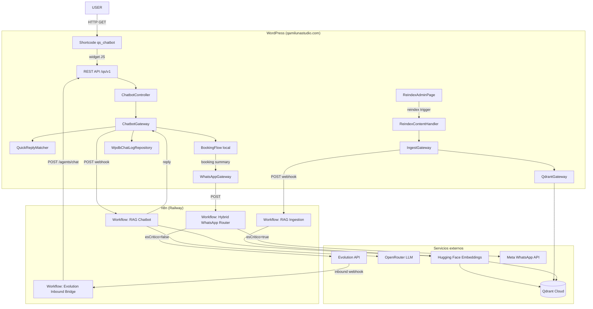
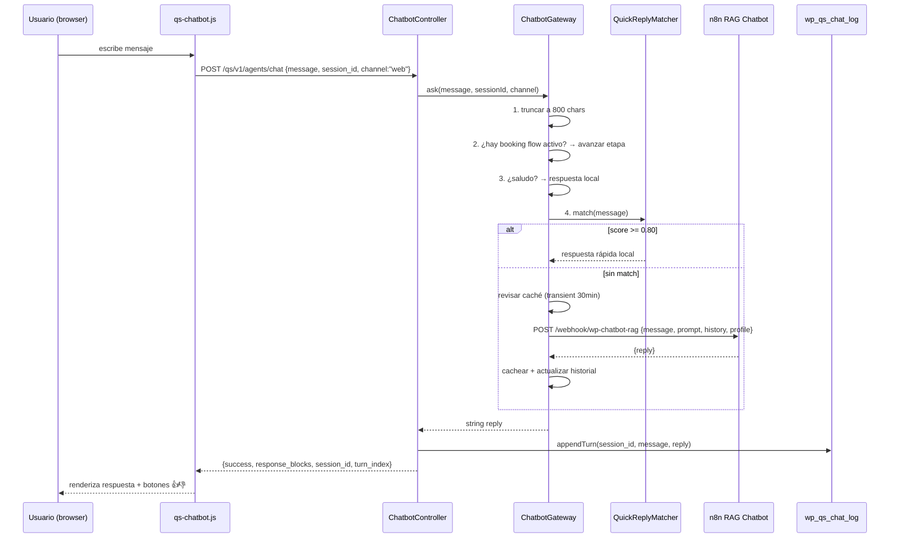
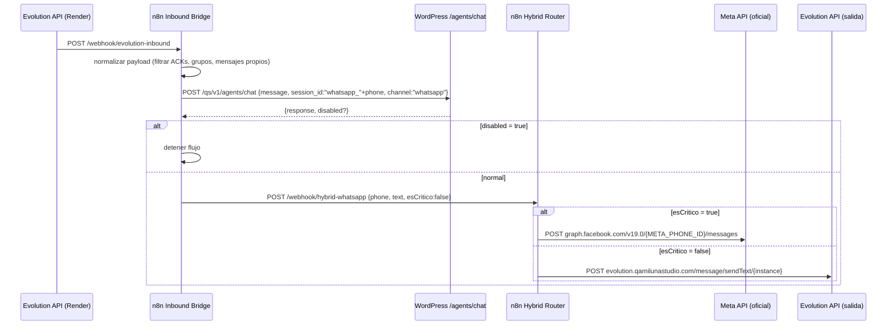
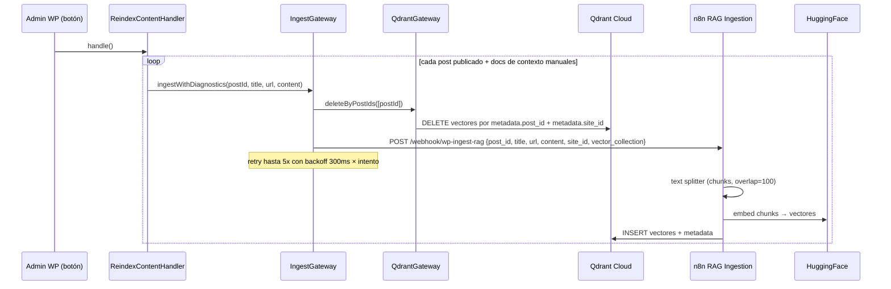

# QS Manager — System Snapshot
> Fecha: 2026-04-26 | Plugin: `qamilunastudio/qs-core` v1.0.0 | PHP 8.1+ | WordPress

Plugin WordPress propietario para **Qamiluna Studio** (maquillaje y peinado, Chile).
Implementa un chatbot RAG (Retrieval-Augmented Generation) con canal web y WhatsApp,
integrado con n8n como orquestador de IA, Qdrant como base vectorial, y Evolution API
como gateway de WhatsApp unofficial.

---

## Servicios externos

| Servicio | URL | Rol |
|---|---|---|
| WordPress | `https://qamilunastudio.com` | CMS, host del plugin, BD principal |
| n8n (Railway) | `https://n8n.qamilunastudio.com` | Orquestador de IA y workflows |
| Qdrant Cloud | `*.eu-west-1-0.aws.cloud.qdrant.io` | Base de datos vectorial |
| Hugging Face | API pública | Embeddings: `distilbert-base-nli-mean-tokens` |
| OpenRouter | API LLM | LLM: `nvidia/nemotron-3-super-120b-a12b:free` |
| Groq | API LLM | LLM alternativo (configurado, no activo) |
| Evolution API (Render) | `https://evolution.qamilunastudio.com` | WhatsApp gateway unofficial |
| Meta WhatsApp Business | `graph.facebook.com/v19.0` | WhatsApp oficial (solo críticos) |
| LatePoint (plugin WP) | tablas internas WP | Reservas (lectura) |
| Railway | PaaS | Host n8n + Postgres, backups |
| cPanel/FTP | secret `FTP_SERVER` | Deploy del plugin |

---

## Arquitectura general



---

## Flujo 1: Chat web (usuario → respuesta)



---

## Flujo 2: Chat WhatsApp (Evolution → usuario)



---

## Flujo 3: Reindexación RAG



---

## Booking flow local (multi-etapa en WordPress)

El `ChatbotGateway` gestiona reservas completamente en WordPress, sin pasar por n8n.

```
stage 1: service     → el usuario elige servicio
stage 2: comuna      → zona/comuna
stage 3: address     → dirección exacta
stage 4: phone       → teléfono de contacto
stage 5: date        → fecha preferida
→ COMPLETADO: WhatsAppGateway envía resumen al staff via hybrid-whatsapp router
```

Estado persiste en transient WordPress: `qs_booking_flow_{sessionId}` (TTL 1h).

---

## Módulos PHP (`app/Modules/`)

```
Agents/          ← chatbot RAG (módulo principal)
Booking/         ← lectura de reservas LatePoint (solo lectura via wpdb)
Finance/         ← pagos, gastos, márgenes. CPTs + exportación CSV
Bitacora/        ← log de servicios a domicilio. CPTs, CRUD REST
Team/            ← staff/MUAs. tabla wp_qs_staff, disponibilidad
ServicesCatalog/ ← catálogo de servicios de LatePoint (solo lectura)
IdentityAccess/  ← roles custom sobre WordPress, políticas de acceso
Setup/           ← provisioning inicial, WP-CLI, AgentStatusChecker
```

---

## Módulo Agents — componentes internos

```
Infrastructure/
  Chatbot/
    ChatbotProfile        ← perfil del bot por sitio (brand, servicios, locale, restricciones)
                            resolución: constante PHP → env QS_CHATBOT_PROFILE_JSON → wp_option → profiles.json
    QuickReplyMatcher     ← respuestas rápidas locales por similaridad (similar_text + Jaccard + containment)
                            threshold: 0.80 (configurable)

  N8n/
    ChatbotGateway        ← orquesta el pipeline completo de respuesta al usuario
    IngestGateway         ← envía documentos a n8n para indexación en Qdrant
    WhatsAppGateway       ← envía mensajes WhatsApp via hybrid-whatsapp router

  Qdrant/
    QdrantGateway         ← API directa a Qdrant: deleteByPostIds(), purgeCollection()

  Persistence/
    WpdbChatLogRepository ← graba turnos en wp_qs_chat_log, registra feedback

  Wordpress/
    ReindexAdminPage      ← panel admin "QS Chatbot" (config + historial de chats)
    ChatbotShortcode      ← shortcode [qs_chatbot]
    ChatbotFallbackResponder ← respuesta amigable cuando n8n falla (incluye URL WhatsApp)

Application/CommandHandler/
    ReindexContentHandler ← itera todos los posts + docs de contexto y llama a IngestGateway

Interfaces/Rest/
    ChatbotController     ← POST /agents/chat, POST /agents/feedback
    WhatsAppOptionsController ← GET|POST /agents/whatsapp-options
```

---

## n8n workflows

| Workflow | Trigger | Función |
|---|---|---|
| `WordPress RAG Chatbot` | POST `/webhook/wp-chatbot-rag` | LLM + RAG con Qdrant. Devuelve respuesta al chatbot |
| `WP RAG Ingestion` | POST `/webhook/wp-ingest-rag` | Divide, embede e inserta en Qdrant |
| `WhatsApp Hybrid Router` | POST `/webhook/hybrid-whatsapp` | Enruta salida WA a Meta API o Evolution |
| `Evolution Inbound Bridge` | POST `/webhook/evolution-inbound` | Recibe de Evolution, consulta WP, reenvía respuesta |

**Stack IA en n8n:**
- Embeddings: `sentence-transformers/distilbert-base-nli-mean-tokens` (HuggingFace)
- LLM: `nvidia/nemotron-3-super-120b-a12b:free` via OpenRouter, temperature 0.1
- Vector store: Qdrant, colección `wordpress_context`, `top_k=5`
- Memory: Window Buffer Memory por `session_id` (ventana 4 turnos en n8n + historial enviado por WP)

---

## CI/CD (GitHub Actions)

```
push → main
  ├── job: quality
  │     PHP 8.1, composer install
  │     validate:structure → php-cs-fixer → phpstan → phpunit --coverage
  │     (en PRs también: infection mutation testing)
  │
  ├── job: package  (requiere quality ✓)
  │     PHP 8.2, composer --no-dev
  │     php tools/package-plugin.php → dist/qs-core.zip
  │     Deploy FTP a cPanel via ftp-sync.php (con retry)
  │
  └── job: deploy_n8n  (requiere quality ✓)
        node tools/n8n/sync/sync_workflows.js
        → upsert de los 4 workflows en n8n producción

cron cada 30min → chatbot-health.yml
  → Test-ChatbotDeployment.ps1
  → si falla: crea/actualiza issue GitHub con label ops-alert

cron diario 06:17 UTC → chatbot-backup.yml
  → Invoke-ChatbotOpsSnapshot.ps1
  → health + export workflows + pg_dump Railway
  → artifact GitHub (30 días retención)
```

---

## Base de datos (WordPress)

**Migraciones en** `database/migrations/`:

| # | Tabla | Contenido |
|---|---|---|
| 0001 | `wp_qs_staff` | Personal del estudio |
| 0002 | `wp_qs_staff_roles` | Roles del personal |
| 0003 | `wp_qs_booking_snapshots` | Snapshots de reservas |
| 0004 | `wp_qs_finance_entries` | Entradas financieras |
| 0005 | `wp_qs_leads_timeline` | Timeline de leads |
| 0006 | `wp_qs_audit_log` | Auditoría |
| 0007 | `wp_qs_service_costs` | Costos por servicio |
| 0008 | *(seed)* | Datos iniciales de costos |
| 0009 | `wp_qs_chat_log` | Turnos del chatbot + feedback (good/bad) |

**`wp_qs_chat_log`:** `id`, `session_id`, `turn_index`, `user_message`, `bot_response`,
`feedback_rating` (good/bad/null), `is_fallback`, `fallback_reason`, timestamps.
Índice único en `(session_id, turn_index)`.

---

## Opciones WordPress relevantes del chatbot

| wp_option | Valor |
|---|---|
| `qs_n8n_chatbot_url` | URL webhook chatbot n8n |
| `qs_n8n_ingest_url` | URL webhook ingesta n8n |
| `qs_qdrant_url` | URL Qdrant Cloud |
| `qs_qdrant_api_key` | API key Qdrant |
| `qs_n8n_whatsapp_url` | URL webhook hybrid-whatsapp |
| `qs_n8n_whatsapp_phone` | Teléfono staff (destino notificaciones) |
| `qs_n8n_whatsapp_instance` | Nombre instancia Evolution |
| `qs_n8n_whatsapp_actions_enabled` | Toggle respuestas automáticas WA |
| `qs_n8n_whatsapp_allowed_phones` | Whitelist teléfonos WA |
| `qs_chatbot_context_documents` | Documentos de contexto manuales (JSON) |
| `qs_chatbot_quick_replies_json` | Reglas quick reply configuradas |
| `qs_chatbot_quick_reply_threshold` | Umbral similaridad (default 0.80) |
| `qs_chatbot_profile_json` | Override de perfil por sitio |
| `qs_chatbot_fallback_whatsapp_url` | URL WA para fallback cuando n8n falla |

---

## Estado actual del canal WhatsApp

- El `WhatsApp Inbound Bridge` está **desactivado** (`active: false` en el JSON versionado).
- El kill switch PHP en `ChatbotController` puede devolver `{disabled: true}` para detener el flujo desde n8n sin cambiar el workflow.
- El `WhatsApp Hybrid Router` está activo y recibe llamadas directas desde WordPress (booking completado, notificaciones al staff).

---

## Perfil del chatbot (qamiluna)

```json
{
  "site_id": "qamiluna",
  "brand_name": "Qamiluna Studio",
  "locale": "es-CL",
  "tone": "amigable, profesional, chileno",
  "vector_collection": "wordpress_context",
  "retrieval_top_k": 5,
  "services": ["maquillaje", "peinado", "tocado", "novias", "eventos"],
  "restrictions": [
    "no revelar precios numéricos exactos",
    "no confirmar fechas de talleres",
    "cotizaciones y talleres redirigir a WhatsApp"
  ],
  "booking_fields": ["service", "comuna", "address", "phone", "date"]
}
```
