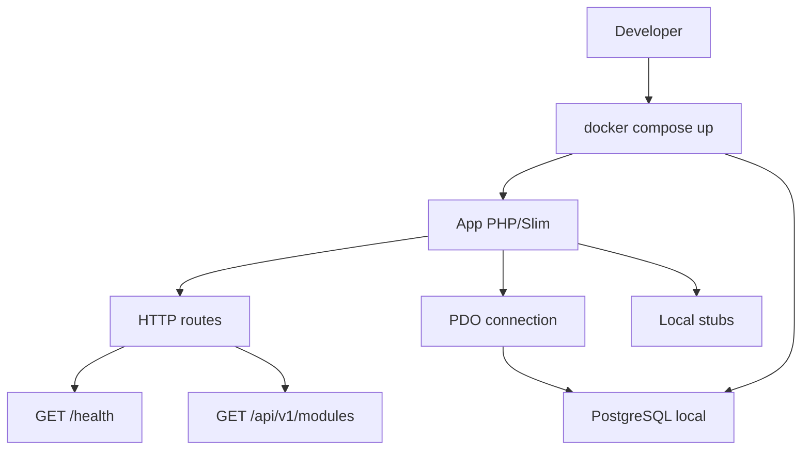

# QS Manager V2 - Greenfield Architecture

## Decision de stack

La V2 se implementa como una aplicacion web standalone con:

- Backend/API: PHP 8.3 + Slim 4 + PDO.
- Base de datos: PostgreSQL 16 en Docker.
- Frontend inicial: API-first. La UI se agregara despues como SPA React o vistas del servidor.
- Entorno local: `docker-compose.yml` con `app` + `db`.

La razon principal para mantener PHP es poder rescatar la logica de negocio de la V1 sin traducir el
dominio a otro lenguaje. Slim se usa para evitar arrastrar un framework grande, WordPress, CPTs,
hooks, `$wpdb` o dependencias operativas de la V1.

## Restricciones de fase 1

- Cero WordPress.
- Cero Qdrant.
- Cero llamadas a LLMs.
- Cero Evolution API o mensajeria externa.
- Cero dependencias cloud obligatorias.
- Todo lo externo se modela como puerto/interfaz y se implementa con stubs locales.

## Estructura propuesta

```text
qs-manager-v2/
  app/
    Application/
      Shared/
    Domain/
      Agents/
      Bitacora/
      Booking/
      CRM/
      Finance/
      IdentityAccess/
      ServicesCatalog/
      Team/
    Infrastructure/
      Database/
      Http/
      Stubs/
    Interfaces/
      Http/
  config/
  database/
    migrations/
  docker/
    app/
  public/
  tests/
  var/
```

## Separacion de capas

### Domain

Contiene entidades, value objects, reglas de negocio y contratos de repositorio. Esta capa no conoce
Slim, PDO, Docker, HTTP, WordPress ni servicios externos.

### Application

Contiene casos de uso y orquestacion. Puede depender del dominio y de puertos, pero no de detalles de
infraestructura.

### Infrastructure

Contiene adaptadores concretos: PDO, configuracion, stubs locales, repositorios SQL y clientes
externos falsos para esta fase.

### Interfaces

Contiene entrada/salida: controladores HTTP, DTOs de request/response y rutas.

## Modulos de negocio

- `Booking`: agenda, reservas y snapshots internos.
- `Team`: staff, disponibilidad, roles operativos y especialidades.
- `ServicesCatalog`: servicios, precios internos y costos base.
- `Finance`: pagos, gastos, margenes y reportes.
- `Bitacora`: actividades y seguimiento operativo.
- `CRM`: leads y pipeline comercial, por ahora con stubs.
- `Agents`: chatbot/agentes, por ahora solo interfaces y mocks locales.
- `IdentityAccess`: usuarios, roles y permisos propios de QS.

## Flujo local inicial



## Politica de migracion desde V1

La V1 no se copia completa. Solo se rescata logica de dominio comprobable:

1. Identificar entidades y reglas puras en `app/Modules/*/Domain`.
2. Copiar o reescribir esas reglas en `qs-manager-v2/app/Domain`.
3. Reemplazar dependencias WordPress por puertos.
4. Implementar adaptadores SQL locales solo cuando el caso de uso este claro.
5. Mantener Agents, CRM y mensajeria como stubs hasta que haya una decision explicita de reactivar
   integraciones.

